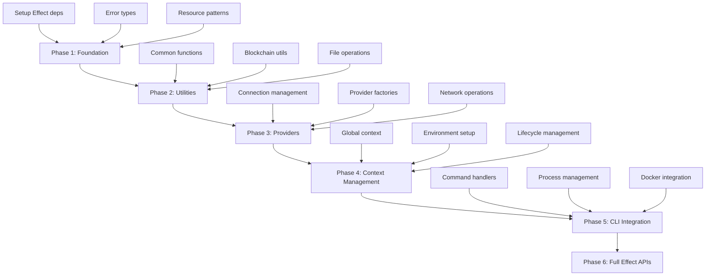
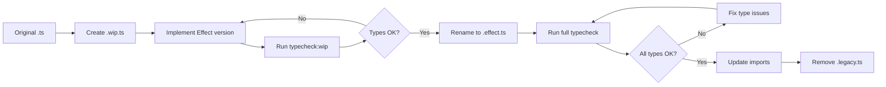

# Effect-TS Migration Design Document

## Overview

This design document outlines the architecture and approach for migrating the Moonwall testing framework from Promise-based TypeScript to Effect-TS. The migration will be performed in phases, starting with low-risk utility functions and gradually moving to core framework components, while maintaining complete backward compatibility.

## Architecture

### Migration Strategy

The migration follows a **Gradual Adoption Pattern** with the following principles:

1. **Internal Effect, External Promise**: All migrated functions will use Effect internally but expose Promise-based APIs externally
2. **Bottom-Up Approach**: Start with leaf functions (utilities) and work toward root functions (CLI/framework)
3. **Dual Implementation**: Maintain both Effect and Promise versions during transition
4. **Resource-First**: Prioritize functions that manage resources (connections, processes, files)

### Phase-Based Migration Plan



## Components and Interfaces

### 1. Effect Foundation Layer

#### Error Types

```typescript
// New error hierarchy for typed errors
export class MoonwallError extends Data.TaggedError("MoonwallError")<{
  readonly message: string
  readonly cause?: unknown
}> {}

export class NetworkError extends MoonwallError.TaggedError("NetworkError")<{
  readonly endpoint: string
  readonly operation: string
}> {}

export class ResourceError extends MoonwallError.TaggedError("ResourceError")<{
  readonly resource: string
  readonly operation: "acquire" | "release" | "use"
}> {}

export class ConfigurationError extends MoonwallError.TaggedError("ConfigurationError")<{
  readonly field: string
  readonly value: unknown
}> {}
```

#### Resource Management

```typescript
// Resource management patterns
export const makeConnection = (endpoint: string) =>
  Effect.acquireRelease(
    Effect.tryPromise({
      try: () => createConnection(endpoint),
      catch: (error) => new NetworkError({ 
        message: "Failed to connect", 
        endpoint, 
        operation: "connect",
        cause: error 
      })
    }),
    (connection) => Effect.promise(() => connection.disconnect())
  )

export const makeDockerContainer = (config: ContainerConfig) =>
  Effect.acquireRelease(
    Effect.tryPromise({
      try: () => docker.createContainer(config),
      catch: (error) => new ResourceError({
        message: "Failed to create container",
        resource: config.name,
        operation: "acquire",
        cause: error
      })
    }),
    (container) => Effect.tryPromise(() => container.remove({ force: true }))
  )
```

### 2. Utility Function Migration

#### Pattern: Effect-Internal, Promise-External

```typescript
// Internal Effect implementation
const checkBalanceEffect = (
  context: DevModeContext,
  account: `0x${string}` = ALITH_ADDRESS,
  block: BlockTag | bigint = "latest"
): Effect.Effect<bigint, NetworkError> =>
  Effect.tryPromise({
    try: () => context.viem().getBalance({ address: account, blockTag: block }),
    catch: (error) => new NetworkError({
      message: "Failed to check balance",
      endpoint: context.viem().transport.url,
      operation: "getBalance",
      cause: error
    })
  })

// External Promise API (backward compatible)
export async function checkBalance(
  context: DevModeContext,
  account?: `0x${string}`,
  block?: BlockTag | bigint
): Promise<bigint> {
  return Effect.runPromise(checkBalanceEffect(context, account, block))
}

// New Effect API (for internal use and future migration)
export const checkBalanceE = checkBalanceEffect
```

### 3. Provider Management

#### Connection Pool with Effect

```typescript
export class EffectProviderPool {
  private readonly pool: Effect.Effect<
    Map<string, ConnectedProvider>,
    ResourceError,
    Scope.Scope
  >

  constructor(private readonly providers: MoonwallProvider[]) {
    this.pool = Effect.acquireRelease(
      Effect.all(
        this.providers.map(provider =>
          Effect.map(
            makeConnection(provider.endpoint),
            connection => [provider.name, connection] as const
          )
        ),
        { concurrency: "unbounded" }
      ).pipe(
        Effect.map(connections => new Map(connections))
      ),
      (connections) => 
        Effect.all(
          Array.from(connections.values()).map(conn => 
            Effect.tryPromise(() => conn.disconnect())
          ),
          { concurrency: "unbounded" }
        ).pipe(Effect.ignore)
    )
  }

  get(name: string): Effect.Effect<ConnectedProvider, ResourceError, Scope.Scope> {
    return Effect.flatMap(this.pool, pool => {
      const provider = pool.get(name)
      return provider 
        ? Effect.succeed(provider)
        : Effect.fail(new ResourceError({
            message: `Provider ${name} not found`,
            resource: name,
            operation: "use"
          }))
    })
  }
}
```

### 4. Context Management

#### Global Context with Effect

```typescript
export class EffectMoonwallContext {
  private readonly context: Effect.Effect<
    MoonwallEnvironment,
    ConfigurationError | ResourceError,
    Scope.Scope
  >

  constructor(config: MoonwallConfig, options?: LaunchOverrides) {
    this.context = Effect.gen(function* (_) {
      // Setup foundation
      const foundation = yield* _(setupFoundation(config, options))
      
      // Start network if needed
      if (foundation.nodes.length > 0) {
        yield* _(startNetwork(foundation.nodes))
      }
      
      // Setup providers
      const providers = yield* _(setupProviders(foundation.providers))
      
      return {
        ...foundation,
        providers
      }
    })
  }

  // Backward compatible Promise API
  static async getContext(
    config?: MoonwallConfig,
    options?: LaunchOverrides
  ): Promise<MoonwallContext> {
    const effectContext = new EffectMoonwallContext(config!, options)
    return Effect.runPromise(
      Effect.scoped(effectContext.context).pipe(
        Effect.map(env => new MoonwallContext(env))
      )
    )
  }
}
```

## Data Models

### Configuration Models

```typescript
// Enhanced configuration with Effect-specific options
export interface EffectMoonwallConfig extends MoonwallConfig {
  effect?: {
    retryPolicy?: {
      maxRetries: number
      baseDelay: Duration.Duration
      maxDelay: Duration.Duration
    }
    timeouts?: {
      connection: Duration.Duration
      operation: Duration.Duration
      cleanup: Duration.Duration
    }
    concurrency?: {
      maxConnections: number
      maxOperations: number
    }
  }
}
```

### Provider Models

```typescript
// Effect-aware provider interface
export interface EffectProvider {
  readonly name: string
  readonly type: ProviderType
  readonly connect: Effect.Effect<ConnectedProvider, NetworkError, never>
  readonly disconnect: Effect.Effect<void, never, never>
}
```

## Error Handling

### Error Hierarchy

```typescript
// Comprehensive error types for different failure modes
export type MoonwallErrors = 
  | NetworkError
  | ResourceError  
  | ConfigurationError
  | TimeoutError
  | ValidationError
  | ProcessError
  | DockerError
```

### Error Recovery Strategies

```typescript
// Retry policies for different operation types
export const networkRetryPolicy = Schedule.exponential(Duration.millis(100)).pipe(
  Schedule.intersect(Schedule.recurs(3)),
  Schedule.whileInput((error: NetworkError) => error.operation !== "fatal")
)

export const resourceRetryPolicy = Schedule.exponential(Duration.millis(50)).pipe(
  Schedule.intersect(Schedule.recurs(5))
)

// Error recovery with fallbacks
export const withFallback = <A, E, R>(
  primary: Effect.Effect<A, E, R>,
  fallback: Effect.Effect<A, E, R>
): Effect.Effect<A, E, R> =>
  Effect.catchAll(primary, () => fallback)
```

## Development Workflow & Type Safety

### Continuous Type Checking Strategy

To ensure type safety without blocking WIP development, we'll extend the existing pnpm monorepo structure with a **WIP-Safe Type Checking** approach:

#### 1. TypeScript Configuration Strategy

```json
// packages/*/tsconfig.wip.json - WIP config for each package
{
  "extends": "./tsconfig.json",
  "compilerOptions": {
    "strict": false,
    "skipLibCheck": true,
    "noImplicitAny": false,
    "noUnusedLocals": false,
    "noUnusedParameters": false
  },
  "include": ["src/**/*.wip.ts", "src/**/*.draft.ts"],
  "exclude": ["src/**/*.ts", "!src/**/*.wip.ts", "!src/**/*.draft.ts"]
}
```

#### 2. File Naming Conventions

- `*.effect.ts` - New Effect-based implementations (strict type checking)
- `*.legacy.ts` - Original Promise-based implementations (for comparison)
- `*.wip.ts` - Work-in-progress files (relaxed type checking)
- `*.draft.ts` - Draft implementations (excluded from main build)

#### 3. Enhanced Development Scripts

```json
// Root package.json additions
{
  "scripts": {
    "typecheck:wip": "pnpm -r --filter='./packages/**' run typecheck:wip",
    "typecheck:watch": "pnpm -r --filter='./packages/**' run typecheck:watch",
    "typecheck:all": "pnpm run typecheck && pnpm run typecheck:wip",
    "dev:effect": "concurrently \"pnpm run typecheck:watch\" \"pnpm run build --watch\""
  }
}

// Individual package.json additions
{
  "scripts": {
    "typecheck:wip": "pnpm exec tsc --noEmit -p tsconfig.wip.json",
    "typecheck:watch": "pnpm exec tsc --noEmit --watch",
    "typecheck:effect": "pnpm exec tsc --noEmit --project tsconfig.json"
  }
}
```

#### 4. Git Hooks & CI Integration

```bash
# .husky/pre-commit (updated to work with existing setup)
#!/bin/sh
pnpm run typecheck
if [ $? -ne 0 ]; then
  echo "❌ Type check failed. Commit blocked."
  echo "💡 Use .wip.ts extension for work-in-progress files"
  echo "💡 Run 'pnpm run typecheck:wip' to check WIP files separately"
  exit 1
fi
```

#### 5. Migration Workflow



## Testing Strategy

### Test Structure

```typescript
// Effect-aware test utilities
export const testEffect = <A, E>(
  effect: Effect.Effect<A, E, never>,
  expected: A
) => Effect.gen(function* (_) {
  const result = yield* _(effect)
  expect(result).toEqual(expected)
})

export const testError = <A, E extends MoonwallError>(
  effect: Effect.Effect<A, E, never>,
  expectedError: E["_tag"]
) => Effect.gen(function* (_) {
  const result = yield* _(Effect.either(effect))
  expect(Either.isLeft(result)).toBe(true)
  if (Either.isLeft(result)) {
    expect(result.left._tag).toBe(expectedError)
  }
})
```

### Resource Testing

```typescript
// Test resource cleanup
export const testResourceCleanup = <A, E, R>(
  resource: Effect.Effect<A, E, R>
) => Effect.gen(function* (_) {
  const cleanupTracker = new Set<string>()
  
  const trackedResource = Effect.acquireRelease(
    Effect.tap(resource, () => Effect.sync(() => cleanupTracker.add("acquired"))),
    () => Effect.sync(() => cleanupTracker.add("released"))
  )
  
  yield* _(Effect.scoped(trackedResource))
  
  expect(cleanupTracker.has("acquired")).toBe(true)
  expect(cleanupTracker.has("released")).toBe(true)
})
```

## Migration Phases

### Phase 1: Foundation (Week 1-2)

- Add Effect-TS dependencies
- Create error type hierarchy  
- Establish resource management patterns
- Create testing utilities
- Document migration patterns

### Phase 2: Utility Functions (Week 3-4)

- Migrate `@moonwall/util` functions
- Focus on pure functions first
- Add comprehensive tests
- Maintain Promise APIs

### Phase 3: Provider Management (Week 5-6)

- Migrate connection management
- Implement resource pooling
- Add retry and timeout logic
- Test connection lifecycle

### Phase 4: Context Management (Week 7-8)

- Migrate global context
- Implement scoped resource management
- Add environment lifecycle management
- Test complex scenarios

### Phase 5: CLI Integration (Week 9-10)

- Migrate command handlers
- Implement process management with Effect
- Add Docker container management
- Test end-to-end workflows

### Phase 6: Full Effect APIs (Week 11-12)

- Expose Effect-based APIs alongside Promise APIs
- Add Effect-specific configuration options
- Create migration guide for users
- Performance optimization

## Performance Considerations

### Optimization Strategies

1. **Lazy Evaluation**: Use Effect's lazy evaluation to avoid unnecessary work
2. **Structured Concurrency**: Replace Promise.all with Effect.all for better error handling
3. **Resource Pooling**: Implement connection pooling with automatic cleanup
4. **Batching**: Use Effect.forEach for batch operations
5. **Caching**: Implement Effect-based caching for expensive operations

### Monitoring

- Add metrics for Effect operations
- Monitor resource usage and cleanup
- Track error rates and retry patterns
- Performance benchmarks for critical paths

## Rollback Strategy

### Rollback Mechanisms

1. **Feature Flags**: Use environment variables to toggle Effect vs Promise implementations
2. **Dual APIs**: Maintain both implementations during transition
3. **Gradual Rollout**: Enable Effect for specific functions/modules
4. **Automated Testing**: Comprehensive test suite to catch regressions
5. **Monitoring**: Real-time monitoring to detect issues early

### Rollback Triggers

- Performance degradation > 20%
- Error rate increase > 5%
- Test failure rate > 1%
- User-reported issues
- Resource leak detection
