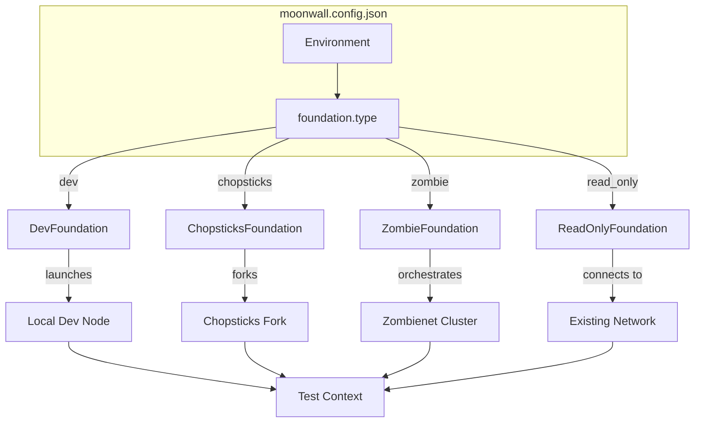
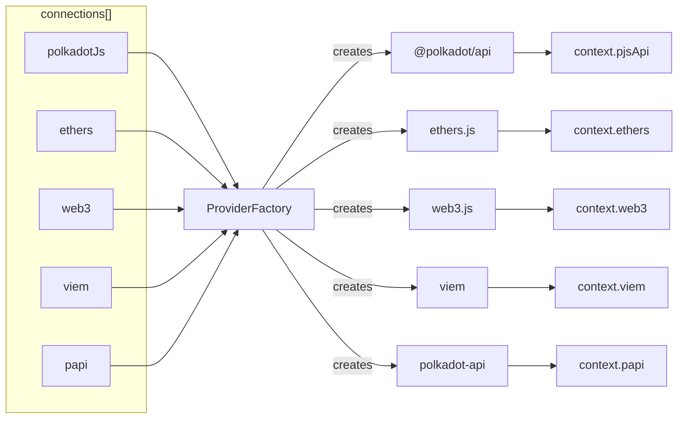
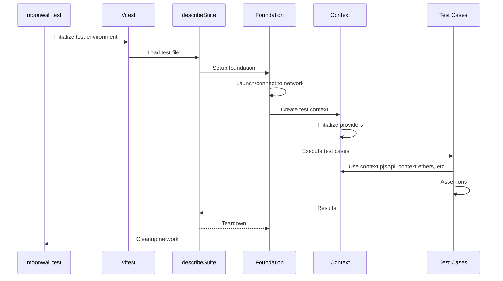
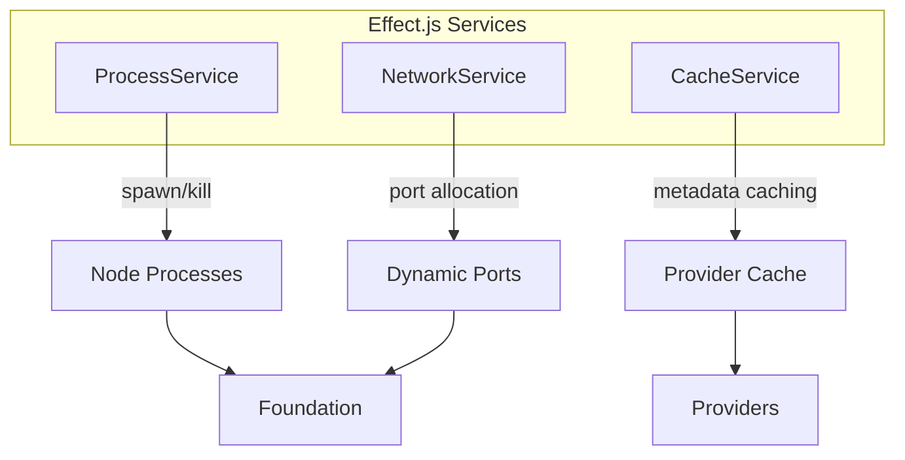
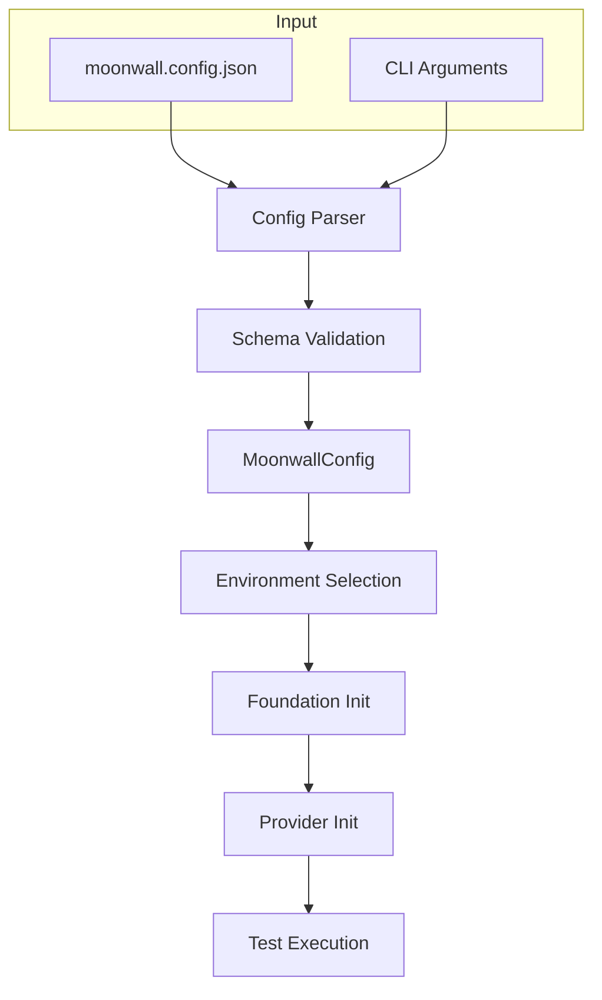

# Architecture

This page provides an overview of Moonwall's internal architecture to help you understand how the framework is organized and how the different components interact.

## Package Structure

Moonwall v1.0.0 is a single unified package, consolidating what was previously split across `@moonwall/cli`, `@moonwall/types`, and `@moonwall/util`.

```
moonwall/
├── src/
│   ├── index.ts          # Public API exports
│   ├── cli.ts            # CLI entry (bin: moonwall)
│   ├── api/              # Types, constants, testing utilities
│   │   ├── types/        # TypeScript types & JSON schema generation
│   │   ├── constants/    # Pre-funded accounts, tokens, precompiles
│   │   └── internal/     # Internal utilities
│   ├── cli/              # CLI commands & libraries
│   │   ├── commands/     # init, test, run, download commands
│   │   └── internal/     # CLI helpers, menus, reporters
│   ├── foundations/      # dev, chopsticks, zombie, read_only
│   └── services/         # Effect.js services (process, network, cache)
├── config_schema.json    # JSON schema for moonwall.config.json
└── test/                 # Internal test suites & examples
```

## Foundation System

Foundations are the core abstraction for launching and managing blockchain networks. Each foundation type handles a specific network deployment strategy.



### Foundation Types

| Foundation | Use Case | Network Management |
|------------|----------|-------------------|
| **dev** | Local development, unit tests | Launches local binary (native or Docker) |
| **chopsticks** | State forking, runtime upgrades | Forks live network state locally |
| **zombie** | Multi-node testing, upgrades | Orchestrates Zombienet clusters |
| **read_only** | Smoke tests, monitoring | Connects to existing networks |

## Provider System

Providers are blockchain client libraries that connect to the network and provide APIs for interaction.



### Provider Types

| Provider | Library | Use Case |
|----------|---------|----------|
| `polkadotJs` | @polkadot/api | Substrate-native interactions, pallets |
| `ethers` | ethers.js | EVM interactions, smart contracts |
| `web3` | web3.js | Alternative EVM library |
| `viem` | viem | Modern TypeScript EVM client |
| `papi` | polkadot-api | Lightweight Substrate client |

## Test Execution Flow



## Context System

Each foundation type provides a specialized context object to tests with relevant methods and properties.

### DevModeContext

Available when using `dev` foundation:

```typescript
context.pjsApi          // Polkadot.js API
context.ethers          // Ethers.js provider
context.viem            // Viem client
context.web3            // Web3.js instance
context.createBlock()   // Mine a new block
context.createTxn()     // Create transaction helper
context.readPrecompile()// Read precompile data
```

### ChopsticksContext

Available when using `chopsticks` foundation:

```typescript
context.pjsApi          // Polkadot.js API
context.setStorage()    // Override chain storage
context.createBlock()   // Produce new block
context.jumpBlocks()    // Skip forward N blocks
context.upgradeRuntime()// Apply runtime upgrade
```

### ZombieContext

Available when using `zombie` foundation:

```typescript
context.pjsApi          // API for parachain
context.relayApi        // API for relay chain
context.zombieNetwork   // Zombienet network object
```

### ReadOnlyContext

Available when using `read_only` foundation:

```typescript
context.pjsApi          // Polkadot.js API (read-only)
context.ethers          // Ethers.js provider (read-only)
context.viem            // Viem client (read-only)
```

## Services Layer

Moonwall uses [Effect.js](https://effect.website/) for managing side effects like process spawning, file I/O, and network operations.



Key services:
- **ProcessService**: Manages node process lifecycle with proper cleanup
- **NetworkService**: Handles port allocation for multi-threaded tests
- **CacheService**: Caches provider metadata for faster connections

## Configuration Flow



## Related Documentation

- [Foundations](/guide/intro/foundations) - Detailed foundation usage
- [Providers](/guide/intro/providers) - Provider configuration
- [Environment Configuration](/config/environment) - Environment options
- [Foundation Configuration](/config/foundation) - Foundation parameters
